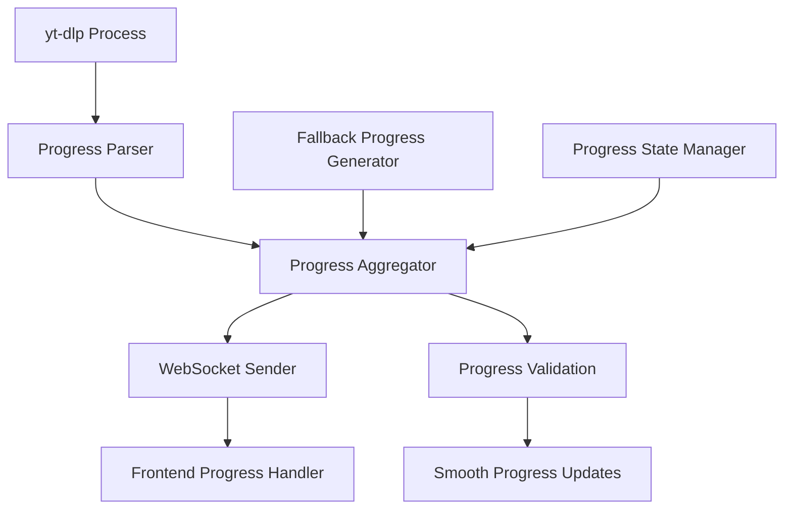

# Design Document

## Overview

The enhanced download progress system will provide real-time progress updates during video downloads by capturing and parsing yt-dlp output, implementing intelligent fallback mechanisms, and delivering smooth progress feedback to users. The system addresses the current gap where users see no feedback between "downloading" and "completed" status.

## Architecture

### Current System Analysis
- **Worker**: Uses subprocess.Popen to execute yt-dlp with real-time stdout/stderr monitoring
- **Progress Parsing**: Basic regex-based parsing exists but needs enhancement
- **WebSocket Updates**: Throttled updates every 2% progress or 5 seconds
- **Frontend**: Has progress bar UI with fake progress simulation
- **Fallback**: Frontend implements fake progress when no real data is available

### Enhanced Architecture Components



## Components and Interfaces

### 1. Enhanced Progress Parser (Worker)

**Location**: `yt-dlp-worker/worker.py` - `parse_progress_line()` method enhancement

**Responsibilities**:
- Parse multiple yt-dlp output formats
- Extract percentage, speed, ETA, file size
- Handle different platform-specific output variations
- Validate and sanitize progress data

**Input Formats to Handle**:
```
[download]  45.2% of 125.3MiB at 2.1MiB/s ETA 00:38
[download] 100% of 125.3MiB in 01:02
[download] Destination: /path/to/file.mp4
```

**Enhanced Regex Patterns**:
```python
PROGRESS_PATTERNS = [
    r'\[download\]\s+(\d+(?:\.\d+)?)%\s+of\s+([^\s]+)\s+at\s+([^\s]+)\s+ETA\s+([^\s]+)',
    r'(\d+(?:\.\d+)?)%.*?at\s+([^\s]+).*?ETA\s+([^\s]+)',
    r'(\d+(?:\.\d+)?)%.*?([^\s]+/s)',
    r'(\d+(?:\.\d+)?)%'
]
```

### 2. Progress State Manager (Worker)

**Location**: New class in `yt-dlp-worker/worker.py`

**Responsibilities**:
- Track progress state per download
- Manage fallback progress generation
- Coordinate between real and simulated progress
- Handle progress validation and smoothing

**State Properties**:
```python
class ProgressState:
    def __init__(self, client_id):
        self.client_id = client_id
        self.real_progress = None
        self.simulated_progress = 0
        self.last_real_update = None
        self.fallback_active = False
        self.progress_history = []
        self.estimated_duration = None
```

### 3. Fallback Progress Generator (Worker)

**Location**: New class in `yt-dlp-worker/worker.py`

**Responsibilities**:
- Generate realistic progress simulation
- Adapt simulation based on download patterns
- Provide smooth progress increments
- Handle different download phases

**Simulation Strategy**:
- **Phase 1 (0-20%)**: Slow start, metadata fetching simulation
- **Phase 2 (20-80%)**: Steady progress based on estimated duration
- **Phase 3 (80-95%)**: Gradual slowdown, avoid reaching 100%
- **Stall Protection**: Never stay at same percentage > 10 seconds

### 4. Enhanced WebSocket Updates (Worker)

**Location**: `yt-dlp-worker/worker.py` - `send_throttled_progress_update()` enhancement

**Responsibilities**:
- Send progress updates with rich metadata
- Implement adaptive throttling
- Handle connection failures gracefully
- Provide detailed progress information

**Enhanced Payload Structure**:
```python
{
    "status": "downloading",
    "client_id": client_id,
    "progress": 45.2,
    "message": "Downloading... 45.2% at 2.1MiB/s ETA 00:38",
    "download_speed": "2.1MiB/s",
    "eta": "00:38",
    "file_size": "125.3MiB",
    "progress_type": "real|simulated",
    "timestamp": "2025-01-08T12:34:56Z"
}
```

### 5. Frontend Progress Enhancement (Server)

**Location**: `yt-dlp-server/templates/index.html` - JavaScript enhancement

**Responsibilities**:
- Handle both real and simulated progress
- Provide smooth visual transitions
- Display rich progress information
- Manage progress bar animations

**Enhanced Progress Display**:
- Speed and ETA information
- Progress type indicator (real vs simulated)
- Smooth progress bar transitions
- Better error handling and recovery

## Data Models

### Progress Update Message
```python
class ProgressUpdate:
    status: str  # "downloading", "processing", "completed", "error"
    client_id: str
    progress: float  # 0-100
    message: str
    download_speed: Optional[str]
    eta: Optional[str]
    file_size: Optional[str]
    progress_type: str  # "real", "simulated", "hybrid"
    timestamp: datetime
    worker: str
```

### Progress State
```python
class ProgressState:
    client_id: str
    real_progress: Optional[float]
    simulated_progress: float
    last_real_update: Optional[datetime]
    fallback_active: bool
    progress_history: List[Tuple[datetime, float]]
    estimated_duration: Optional[int]  # seconds
    download_start_time: datetime
    current_phase: str  # "initializing", "downloading", "finalizing"
```

## Error Handling

### Progress Parsing Errors
- **Invalid Progress Values**: Clamp to 0-100 range, log warnings
- **Malformed Output**: Continue with fallback progress, log parsing failures
- **Missing Progress Data**: Activate simulated progress after 5-second timeout

### WebSocket Communication Errors
- **Connection Lost**: Queue updates, retry with exponential backoff
- **Send Failures**: Log errors, continue processing, attempt reconnection
- **Timeout Errors**: Reduce update frequency, implement circuit breaker

### Fallback Scenarios
- **No yt-dlp Progress**: Immediate fallback to simulated progress
- **Stalled Progress**: Detect stalls (no change for 15 seconds), supplement with simulation
- **Inconsistent Progress**: Validate progress increases, smooth out anomalies

## Testing Strategy

### Unit Tests
- **Progress Parser**: Test various yt-dlp output formats
- **State Manager**: Test state transitions and fallback logic
- **Fallback Generator**: Test simulation algorithms and timing
- **WebSocket Updates**: Test throttling and error handling

### Integration Tests
- **End-to-End Progress**: Test complete download with progress updates
- **Fallback Scenarios**: Test behavior when yt-dlp provides no progress
- **Error Recovery**: Test recovery from various error conditions
- **Multiple Downloads**: Test concurrent download progress tracking

### Manual Testing Scenarios
- **Various Platforms**: Test with YouTube, Instagram, TikTok, Twitter
- **Different File Sizes**: Test with small and large files
- **Network Conditions**: Test with slow and fast connections
- **Error Conditions**: Test with invalid URLs and network failures

## Implementation Phases

### Phase 1: Enhanced Progress Parsing
- Improve regex patterns for yt-dlp output parsing
- Add support for multiple output formats
- Implement progress validation and sanitization
- Add comprehensive logging for debugging

### Phase 2: Fallback Progress System
- Implement ProgressState management
- Create FallbackProgressGenerator class
- Add intelligent progress simulation
- Implement smooth transitions between real and simulated progress

### Phase 3: Enhanced WebSocket Communication
- Improve progress update payload structure
- Add adaptive throttling based on progress rate
- Implement better error handling and recovery
- Add progress type indicators

### Phase 4: Frontend Enhancements
- Update JavaScript to handle enhanced progress data
- Improve progress bar visual feedback
- Add speed and ETA display
- Implement better error states and recovery

### Phase 5: Testing and Optimization
- Add comprehensive test coverage
- Performance optimization for high-frequency updates
- Fine-tune simulation algorithms
- Add monitoring and metrics collection